<!-- .slide: id="custom" data-background="./assets/mountains.jpg" -->
## __Debugging JavaScript__
### _A Journey into the Unknown*_
<div style="text-align: right">_*hopefully_</div>
<div style="font-size: 9px; text-align: right;"><em>Photo: https://unsplash.com/@asoggetti</em></div>

Note:
Before you begin...
* Run `npm start` in a different terminal
* Clear all dev tool artifacts
* Make sure dev tools are ordered `elements`, `console` then `sources`
* Make sure `docker` is running
* Hide bookmarks bar in Chrome
* Start server from Terminal

----


@stetsmando/debuggingjs

----
# Feedback?

@github/stetsmando/debuggingjs/issues

----
# Before We Begin
Note: 
* Why I created this talk
* What I hope you take away
* Assume you’ve written some amount of JavaScript
* Originally filled 90min, cut to 70, now to 50

----


---
### About Me

* **@stetsmando** - Twitter, Github, etc.
* Software Architect **@Berkadia**
* Using JavaScript in some form since 2011
* Other Languages
  * C#
  * Java (Android)
  * Scripting things
  * Other Stuff
* Love JavaScript
* Hate Debugging JavaScript


---
##  Show of Hands 

```javascript
console.log('Something Useful')
```

----
# Pro Tips:
```javascript
// Pretty prints objects in console
console.log(JSON.stringify(someObj, null, 2))
```
&
```javascript
// Creates a breakpoint when debugger is connected
debugger
```

---
# Story Time

----


----
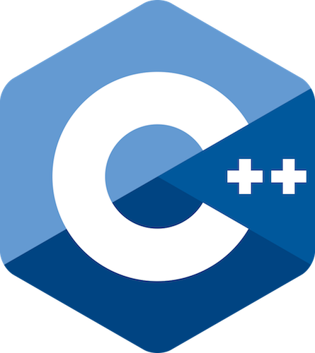

----
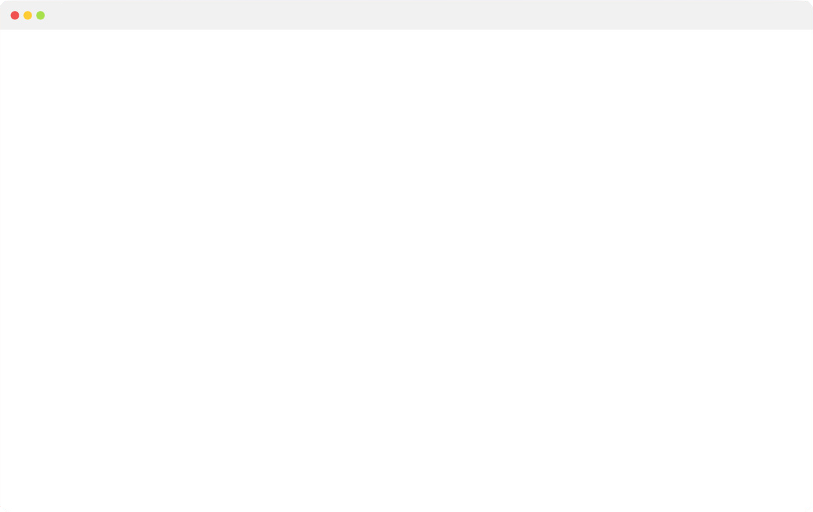

----
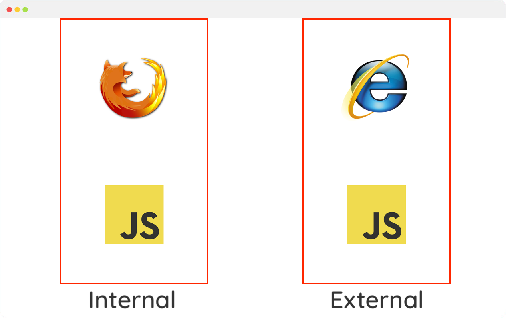

----
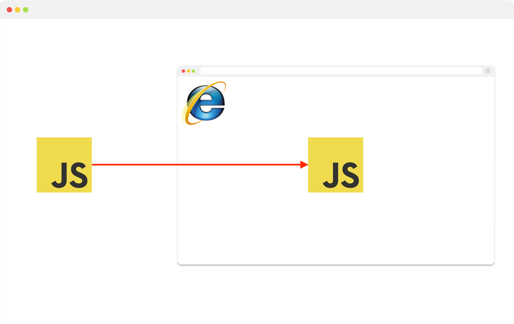

----
# ?

----
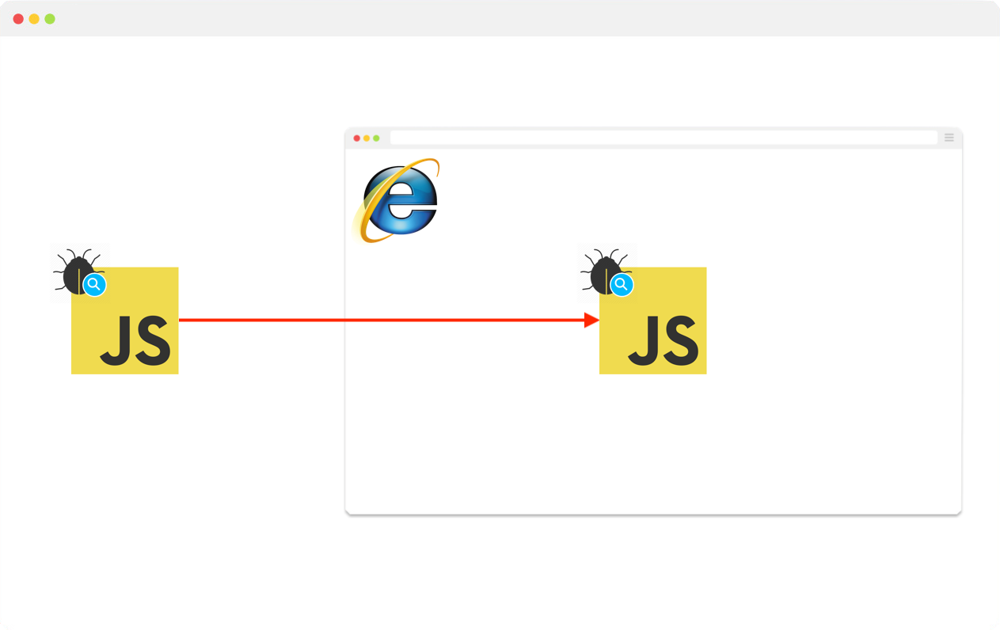

----


---
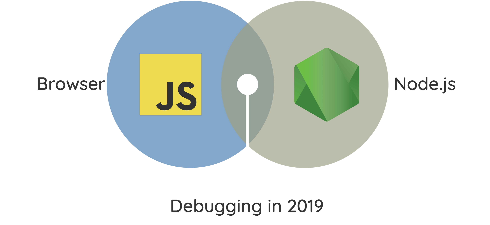

---
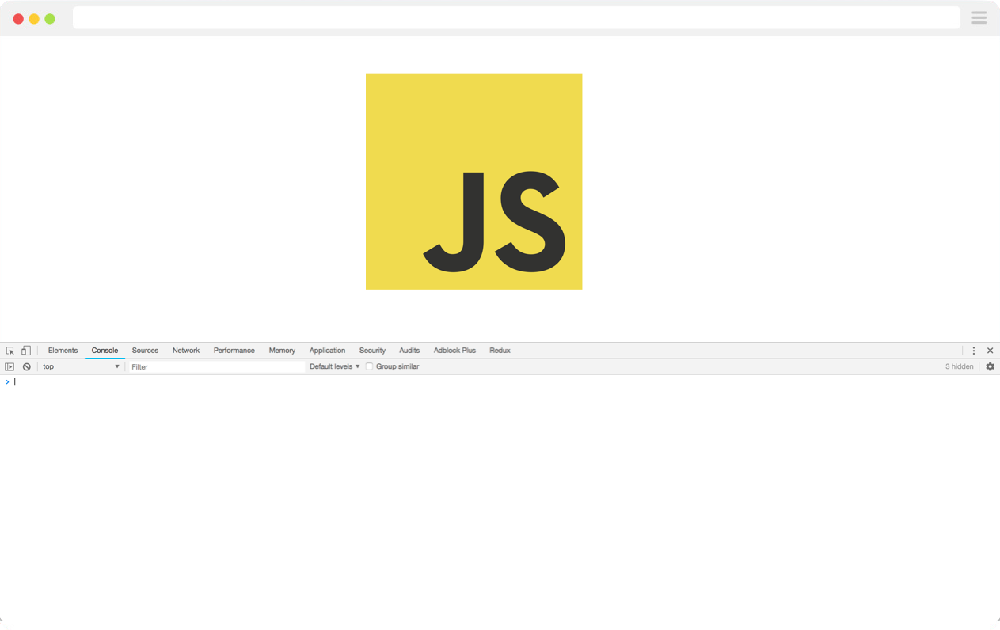

----


----


{ Dev Tools }

----


---


Tour of DevTools

----
⌘ + ⌥ + J

⌃ + ↑ + J

----
### Demo App
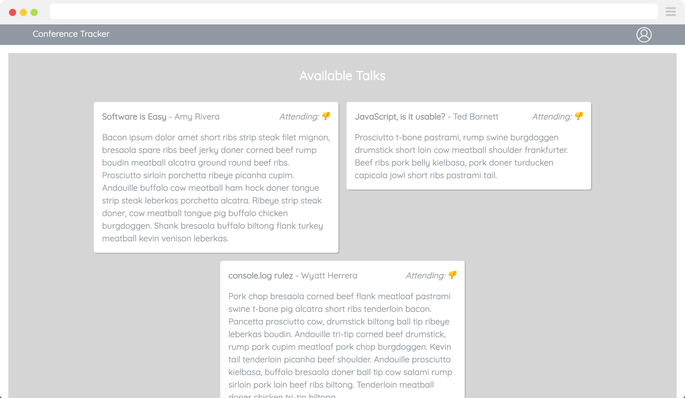

Note:
* The demo should give a quick walkthrough of the dev tools,
* Show off debugging `attending` not updating in UI
  * Show off the `mouse => click` Event Listener Breakpoints
  * Blackboxing scripts
  * Linking to local files
  * Show `debugger` statements

----

## You 👇


---


----
<!-- .slide: id="custom" data-background="./assets/node-legacy.jpg" -->

----
<!-- .slide: id="custom" data-background="./assets/node-inspector.png" -->

Note:
Debug the server portion of the `attending` feature

----


----
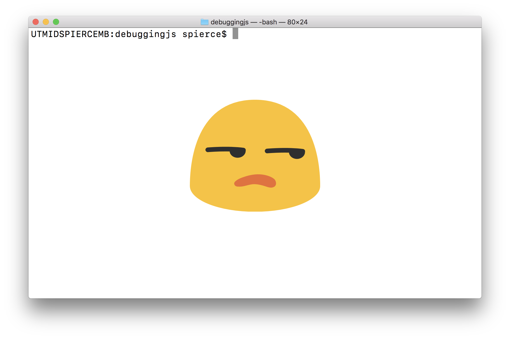

----
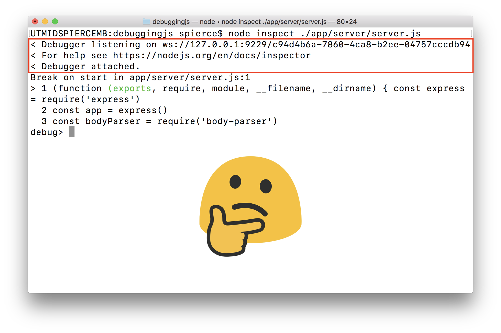

----
# --inspect

----
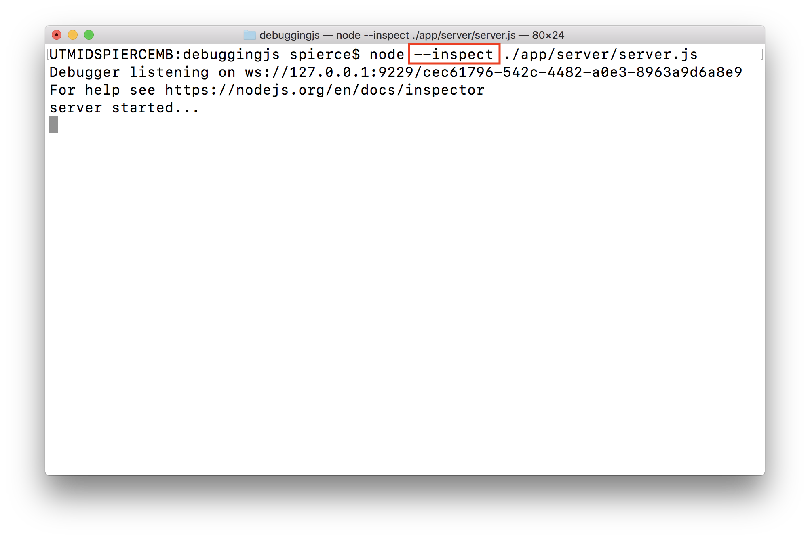

----


----


----


---


----
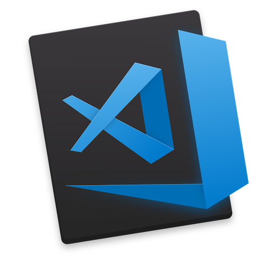

Note:
Show how to configure vscode to connect to node inspector

---
*Let's talk about the **whale** in the room*

----
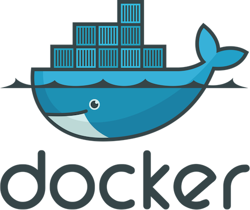

----
<!-- .slide: id="custom" data-background="./assets/docker-container.png" -->

----


----
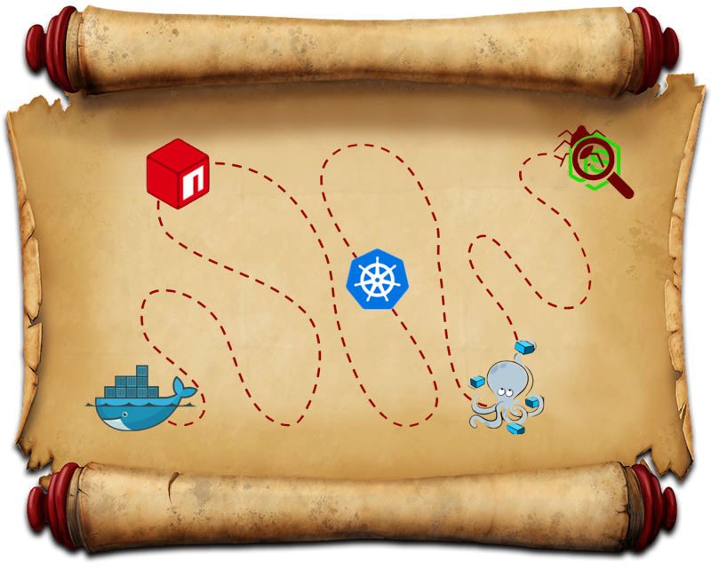

---
# Thank You

----
# Feedback?

@stetsmando/debuggingjs/issues

----
<!-- .slide: id="custom" data-background="./assets/questions.jpg" -->

# Questions?
<div style="font-size: 9px; text-align: right;"><em>Photo: https://unsplash.com/@evan__bray</em></div>
